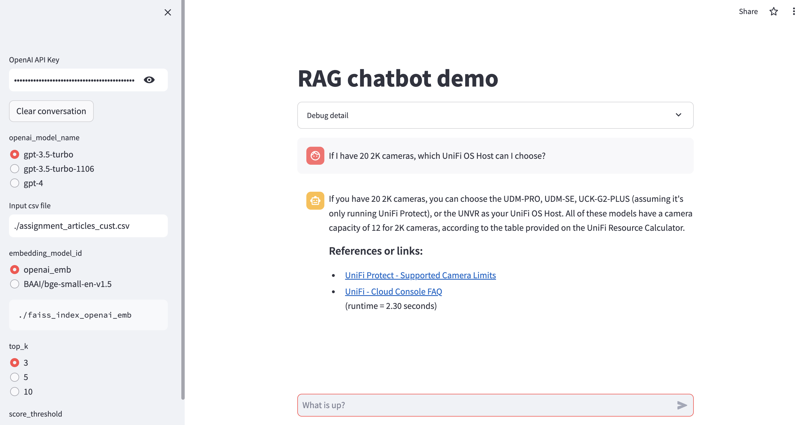

# rag-chatbot
LLM chatbot based on Retrieval Augmented Generation (RAG)

### [online demo](https://rag-chatbot.streamlit.app/)

### Virtual env & install packages (with Python3.10+)  
$virtualenv venv  
$source ./venv/bin/activate  
$(venv) pip install requirements.txt  

### Knowledge base data & build vec index (optional)
You need to provide a csv file with header of ['link', 'title', 'body']  
'body' column is html format, but it will convert to markdown format later  
* using download embedding model:  
$python build_vec.py -m openai_emb  
* using OpenAI embedding model:  
$python build_vec.py -m openai_emb -k OpenAI API key  

### Run streamlit
$streamlit run chat.py  
